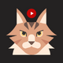

<div id="top"></div>
<!-- PROJECT SHIELDS -->

<!-- PROJECT LOGO -->
<br />
<div align="center">
  <a href="https://github.com/snowleopardAlexa/cats-videos-app-frontend">
    
  </a>

<h3 align="center">Cats Videos App</h3>

  <p align="center">
    This is a front-end for cats-videos-app. For right now you can see multiple videos of cats displayed on the screen and when you click on WATCH NOW button
    you can see a single video card. You can play the video. You can also like and unlike video. When you clik on the icon video edit - a modal will pop up. A functionality EDIT will be implemented next. 
    <br />
    <a href="https://github.com/snowleopardAlexa/instagram-clone"><strong>Explore the docs »</strong></a>
    <br />
    <br />
    <a href="">View Demo</a>
    ·
    <a href="https://github.com/snowleopardAlexa/cats-video-app-frontend/issues">Report Bug</a>
    ·
    <a href="https://github.com/snowleopardAlexa/cats-video-app-frontend/issues">Request Feature</a>
  </p>
</div>


<!-- TABLE OF CONTENTS -->
<details>
  <summary>Table of Contents</summary>
  <ol>
    <li>
      <a href="#about-the-project">About The Project</a>
      <ul>
        <li><a href="#built-with">Built With</a></li>
      </ul>
    </li>
    <li>
      <a href="#getting-started">Getting Started</a>
      <ul>
        <li><a href="#installation">Installation</a></li>
        <li><a href="#dependencies">Dependencies</a></li>
      </ul>
    </li>
    <li><a href="#usage">Usage</a></li>
    <li><a href="#roadmap">Roadmap</a></li>
    <li><a href="#contributing">Contributing</a></li>
    <li><a href="#license">License</a></li>
    <li><a href="#contact">Contact</a></li>
    <li><a href="#acknowledgments">Acknowledgments</a></li>
  </ol>
</details>


<!-- ABOUT THE PROJECT -->
## Cats Videos App

 https://instagram-clone-snowleopardalexa.vercel.app/

### Built With

* [React.js](https://reactjs.org/)
* [TailwindCSS](https://tailwindcss.com/)


<p align="right">(<a href="#top">back to top</a>)</p>


<!-- GETTING STARTED -->
## Getting Started

To get a local copy up and running follow these simple example steps.

### Installation

1. Clone the repo
   ```sh
   git clone https://github.com/snowleopardAlexa/cats-video-app.git
   ```
2. Install NPM packages
   ```sh
   npm install
   ```

<p align="right">(<a href="#top">back to top</a>)</p>

### Dependencies

- react: "^17.0.0",
- react-dom: "^17.0.0",
- react-router-dom: "^6.3.0",
- autoprefixer: "^10.4.4",
- postcss: "^8.4.12",
- tailwindcss: "^3.0.24"

<!-- USAGE EXAMPLES -->
## Usage

This project had been built for an assignment. 

<p align="right">(<a href="#top">back to top</a>)</p>


<!-- ROADMAP -->
## Roadmap

1. Create React App
2. Install React Router DOM
3. Create Header component
4. Create Footer component
5. Create HomePage component
6. Create VideoDetail component
7. Implement React Router
8. Fetch Dataa from Strapi API
9. Style Ui with TailwindCSS

<p align="right">(<a href="#top">back to top</a>)</p>


<!-- CONTRIBUTING -->
## Contributing

Contributions are what make the open source community such an amazing place to learn, inspire, and create. Any contributions you make are **greatly appreciated**.

If you have a suggestion that would make this better, please fork the repo and create a pull request. You can also simply open an issue with the tag "enhancement".
Don't forget to give the project a star! Thanks again!

1. Fork the Project
2. Create your Feature Branch (`git checkout -b feature/AmazingFeature`)
3. Commit your Changes (`git commit -m 'Add some AmazingFeature'`)
4. Push to the Branch (`git push origin feature/AmazingFeature`)
5. Open a Pull Request

<p align="right">(<a href="#top">back to top</a>)</p>


<!-- LICENSE -->
## License

None

<p align="right">(<a href="#top">back to top</a>)</p>


<!-- CONTACT -->
## Contact

Aleksandra Slomska - aleksandravslomska@gmail.com

Project Link: https://github.com/snowleopardAlexa/cats-videos-app-frontend

<p align="right">(<a href="#top">back to top</a>)</p>


<!-- MARKDOWN LINKS & IMAGES -->
<!-- https://www.markdownguide.org/basic-syntax/#reference-style-links -->
[contributors-shield]: https://img.shields.io/github/contributors/snowleopardAlexa/medium-clone.svg?style=for-the-badge
[contributors-url]: https://github.com/github_username/repo_name/graphs/contributors
[forks-shield]: https://img.shields.io/github/forks/github_username/repo_name.svg?style=for-the-badge
[forks-url]: https://github.com/github_username/repo_name/network/members
[stars-shield]: https://img.shields.io/github/stars/github_username/repo_name.svg?style=for-the-badge
[stars-url]: https://github.com/github_username/repo_name/stargazers
[issues-shield]: https://img.shields.io/github/issues/github_username/repo_name.svg?style=for-the-badge
[issues-url]: https://github.com/github_username/repo_name/issues
[license-shield]: https://img.shields.io/github/license/github_username/repo_name.svg?style=for-the-badge
[license-url]: https://github.com/github_username/repo_name/blob/master/LICENSE.txt
[linkedin-shield]: https://img.shields.io/badge/-LinkedIn-black.svg?style=for-the-badge&logo=linkedin&colorB=555
[linkedin-url]: https://linkedin.com/in/linkedin_username
[product-screenshot]: images/screenshot.png
